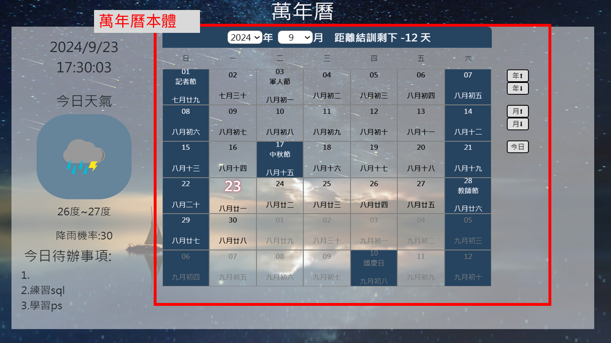
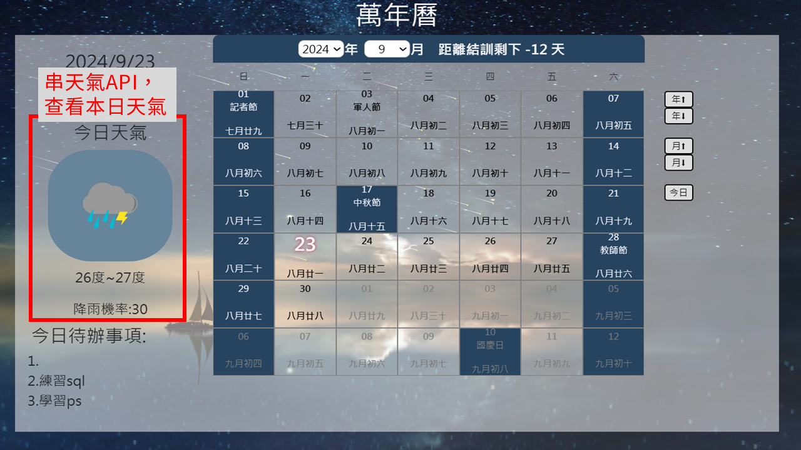
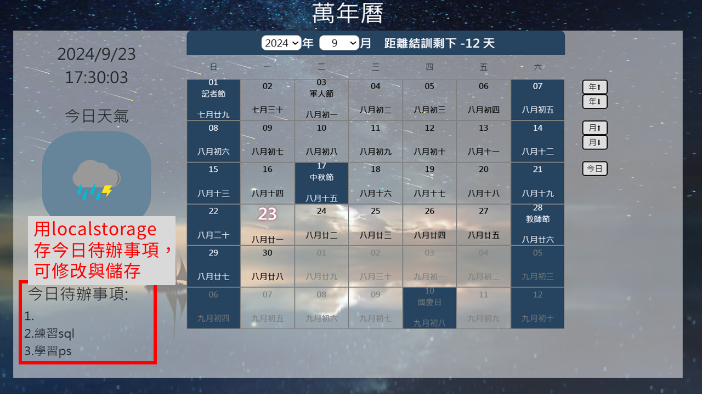
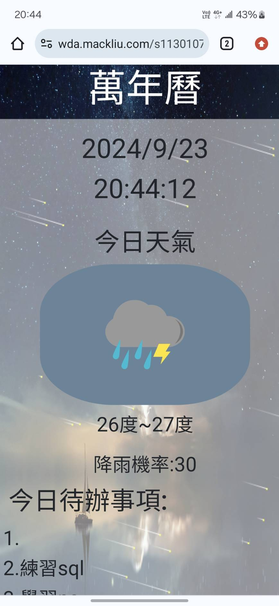

# 萬年曆

## 展示網站:
https://reurl.cc/LlegzL

## 主要功能:
1. 萬年曆主體，可查看每日星期幾
2. 串接天氣api，可查看每日天氣
3. 今日待辦事項，可記錄提醒本日須完成事項
4. RWD，手機也可觀看
-----------------
1. 萬年曆主體，可查看每日星期幾

　　
2. 串接天氣api，可查看每日天氣

   
3. 今日待辦事項，可記錄提醒本日須完成事項

   
4. RWD，手機也可觀看

